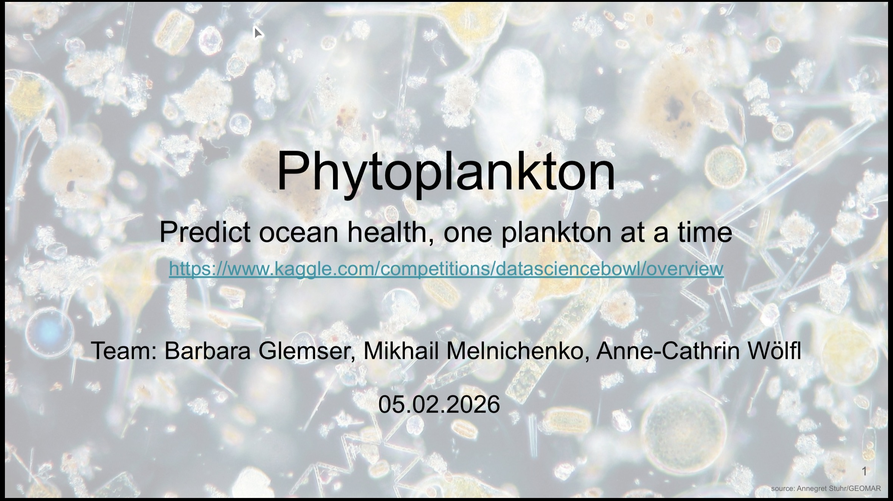

# Phytoplankton

## Repository Link

https://github.com/bglemser/Phytoplankton

## Description

Our project is based on the following kaggle competition:
[Link](https://www.kaggle.com/competitions/datasciencebowl/overview)
The goal of the competition is the automated classification of plankton images. These images were optained by towing an underwater camera in the Strait of Florida between May-June 2014. 

### Task Type

Image Classification

### Results Summary

#### Best Model Performance
- **Best Model:** EfficientNet B1
- **Evaluation Metric:** F1 score
- **Final Performance:** 0.72 Macro F1 Score

#### Model Comparison
- **Baseline Performance:** 0.75 Macro F1 score but with a smaller dataset using only half of the classes
- **Improvement Over Baseline:** Lost a bit on Macro F1 score (0,03) but not as much as expected with 60 more classes
- **Best Alternative Model:** EfficientNetV2

#### Key Insights
- **Most Important Features:** Data augmentation, image size, normalization 
- **Model Strengths:** Good performance in classes with many images
- **Model Limitations:** Limitations with unknown classes
- **Business Impact:** Easier detection of ocean health

## Documentation

1. **[Literature Review](0_LiteratureReview/README.md)**
2. **[Dataset Characteristics](1_DatasetCharacteristics/exploratory_data_analysis.ipynb)**
3. **[Baseline Model](2_BaselineModel/baseline_model.ipynb)**
4. **[Model Definition and Evaluation](3_Model/model_definition_evaluation)**
5. **[Presentation](4_Presentation/README.md)**

## Cover Image

